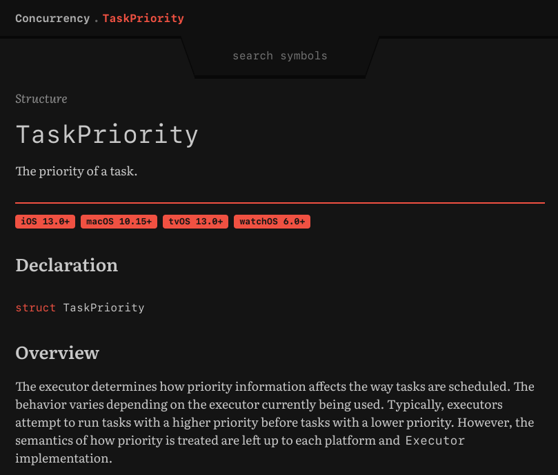

  <strong><em><code>swift-biome</code></em></strong> <small><code>0.3.0</code></small>

> *Entrapta* is now **SwiftBiome**!

*Biome* is a pure-Swift documentation engine for generating and retrieving DocC-style API reference pages. **Biome aims to be backwards-compatible with the ad-hoc Markdown-based documentation formats popular among many existing Swift packages.** For example, *Biome* can import symbol graphs for the Swift standard library and render them as DocC-style reference pages, even though the Swift standard library is not documented in a DocC-compatible format.

Since `0.2.0`, *Biome* (formerly named *Entrapta*) is no longer a site generator. Instead, it is meant to be the back-end component of a web server or a static site generator. *Biome* handles symbol graph parsing, cross-linking, organization, presentation, HTML rendering, and query routing.

A major design goal of *Biome* is to support **multi-package, multi-module use cases**. Over time, as the Swift package ecosystem has matured, more and more people are writing Swift on non-Apple platforms. Unlike in the early days of Swift, when large monolithic frameworks such as *Foundation* or *UIKit* were the norm, the Swift Package Manager has enabled greater modularization and atomization of Swift libraries. This is a good thing for the Swift community! However, this also exposes the limitations of single-module documentation engines, which do not provide an easy way to navigate between symbols in different, interconnected modules, or filter-out irrelevant imports.

*Biome* powers the Swift standard library reference at [`swiftinit.org/reference/swift`](https://swiftinit.org/reference/swift)! It mostly has parity with the existing Apple Swift reference, although *Biome* doesn’t have access to the topical organization Apple uses on their site, so it uses a default, hierarchical organization for the standard library pages. There are a few missing features we are actively working on implementing: 

* <s>Deprecation and availability tables</s>

* <s>Parsing ad-hoc function parameter documentation from Markdown comments</s>

* <s>An auto-complete function</s> 

* Links from API reference pages to original source code

* Detecting default implementations

*Biome* already has a few features the Apple docs do not:

* Marking overridden protocol requirements as `associatedtype` inference hints, to reduce symbol clutter in namespaces like [`BidirectionalCollection`](https://swiftinit.org/reference/swift/bidirectionalcollection).

* Fast, fuzzy typeahead search.

* Placing protocol requirements in their own section. 

* Stable links to API reference pages, and a robust overload disambiguation system based on compiler-mangled symbol names. 

* Cross-package and cross-module symbol linking

* URL normalization

* Reduced need for disambiguation suffixes like `-enum` or `-struct`

Since `0.2.0`, *Biome* now uses `swift-symbolgraph-extract` as its static analysis backend. This greatly reduces the amount of effort needed to write *Biome*-compatible documentation comments, and provides much more accurate symbol linking and relationship analysis. However, the information `swift-symbolgraph-extract` provides is much more limited than what *Biome* `0.1.0` had access to, which means the following features are no longer implemented:

* Symbol linking and member lookup on `associatedtype`s, generics, and `typealias`es

* Generic constraint-based member lookup

* Symbol linking inside code blocks 

* Symbol links from the punctuation characters in sugared forms of `Array` (`[_]`), `Dictionary` (`[_:_]`), and `Optional` (`_?`) to the appropriate reference pages

* Links from metatype suffixes (`.Type`, `.Protocol`) and keyword types (`Any`) to relevant chapters of the *The Swift Programming Language*

* Links for built-in operator lexemes (the lexemes themselves, not the functions that use them as identifiers)

* Links and reference pages for custom operator lexemes 

* Annotations for members satisfying protocol requirements 

We are working on resurrecting some of these features using `swift-syntax` and information provided by the new symbol graph backend.
